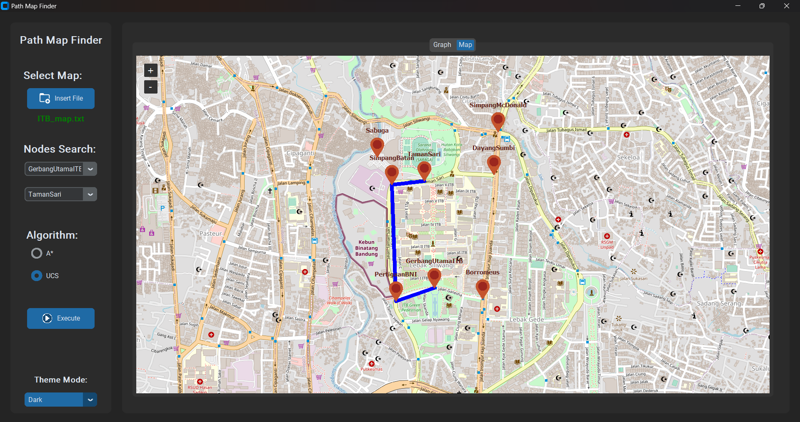
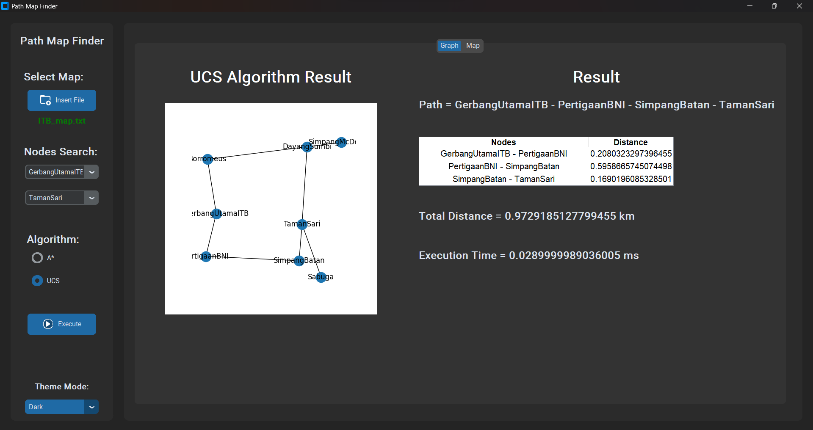
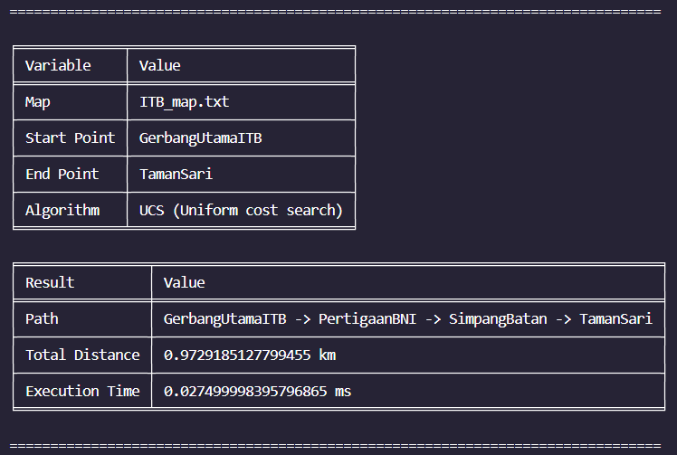
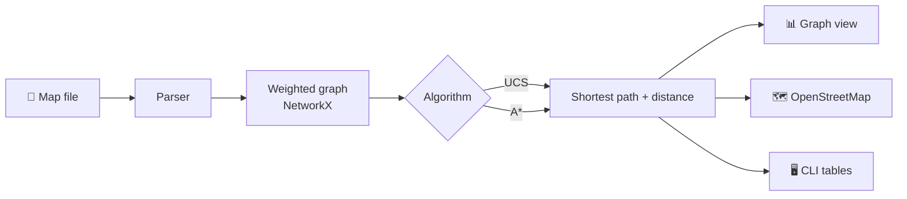

<div align="center">

# 🗺️ Path Map Finder

**Find the shortest route between two places on a real map, powered by Uniform Cost Search and A\*.**

[](https://www.python.org/)
[](https://github.com/TomSchimansky/CustomTkinter)
[](https://networkx.org/)
[](https://www.openstreetmap.org/)




</div>

---

## ✨ Highlights

- 🧭 **Two search algorithms:** Uniform Cost Search (UCS) and A\* with a straight-line (Euclidean) heuristic
- 🌍 **Real-world maps:** every node is a real GPS coordinate, and the route is drawn on an interactive OpenStreetMap view
- 📊 **Graph view:** the full road network rendered with NetworkX and Matplotlib, next to a per-segment distance table
- ⏱️ **Metrics:** total distance and execution time for every search
- 🖥️ **CLI export:** print the query and its result as clean tables in the terminal
- 🌗 **Dark and light themes**, built with CustomTkinter
- 🛡️ **Input validation:** malformed map files are rejected before any search runs

## 📸 Screenshots

| Graph view | CLI output |
|:---:|:---:|
|  |  |

## ⚙️ How It Works


```mermaid
flowchart LR
    A[📄 Map file] --> B[Parser]
    B --> C[Weighted graph<br/>NetworkX]
    C --> D{Algorithm}
    D -->|UCS| E[Shortest path + distance]
    D -->|A*| E
    E --> F[📊 Graph view]
    E --> G[🗺️ OpenStreetMap]
    E --> H[🖥️ CLI tables]
```

Each edge is weighted by the straight-line distance between its two nodes' coordinates.

| | UCS | A\* |
|---|---|---|
| Expands the node with the lowest | path cost so far, `g(n)` | `f(n) = g(n) + h(n)` |
| Heuristic `h(n)` | none | Euclidean distance to the goal |
| Result | ✅ optimal | ✅ optimal (the heuristic never overestimates), usually exploring fewer nodes |

## 🚀 Getting Started

**Prerequisites:** Python 3 with Tkinter (included in the python.org installers).

```bash
git clone https://github.com/AustinPardosi/Path-Map-Finder.git
cd Path-Map-Finder
pip install matplotlib networkx pillow tkintermapview customtkinter tabulate
python src/main.py
```

> 🌐 The map view downloads OpenStreetMap tiles, so it needs an internet connection.

## 🕹️ Usage

1. Click **Insert File** and pick a map from [`test/`](test)
2. Choose a **start** and a **goal** node
3. Select **A\*** or **UCS**
4. Hit **Execute** to see the path, total distance, and execution time
5. Open the **Map** tab to see the route on OpenStreetMap
6. Click **Print To CLI** to print the result in your terminal

## 🧩 Map File Format

```text
8
GerbangUtamaITB -6.893177802481791 107.61043913136548
PertigaanBNI -6.893844716268942 107.60846860579544
...
0 1 0 0 0 0 1 0
1 0 1 0 0 0 0 0
...
```

- **Line 1:** number of nodes `N` (at least 8)
- **Next `N` lines:** `name latitude longitude`, where names contain no spaces
- **Last `N` lines:** an `N × N` adjacency matrix where `1` means connected and the diagonal is `0`

Four sample maps are included: the ITB campus, Buah Batu, and Alun-Alun in Bandung, and Sekip in Medan.

## 📁 Project Structure

```text
Path-Map-Finder/
├── src/
│   ├── main.py              # GUI, graph and map rendering, CLI export
│   ├── algorithm.py         # UCS and A* implementations
│   └── parse_into_graph.py  # map file parser and graph builder
├── test/                    # sample maps
├── img/                     # screenshots and button icons
└── doc/                     # full project report (PDF)
```

## 👥 Team

| Name | GitHub |
|---|---|
| Austin Gabriel Pardosi | [@AustinPardosi](https://github.com/AustinPardosi) |
| Salomo Reinhart Gregory Manalu | [@Salomo309](https://github.com/Salomo309) |

## 🎓 Acknowledgements

Built in April 2023 for **IF2211 Algorithm Strategies** at Institut Teknologi Bandung. Thanks to God Almighty, to our lecturers Bu Ulfa, Pak Rinaldi, and Pak Rila, and to the IF2211 teaching assistants.
