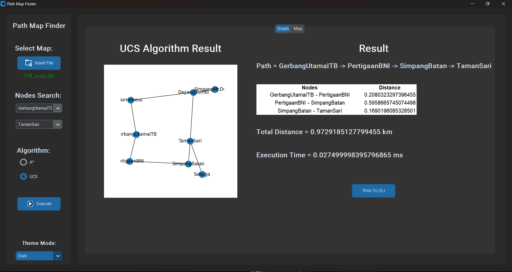

# Tucil3_13521063_13521084
Repository Tugas Kecil 3 Mata Kuliah Strategi Algoritma

## Table of Contents
* [General Information](#general-information)
* [Languange Used](#languange-used)
* [Features](#features)
* [Repository Structure](#repository-structure)
* [Setup](#setup)
* [How to Compile and Run](#how-to-compile-and-run)
* [Project Status](#project-status)
* [Acknowledgements](#acknowledgements)
* [Contacts](#contacts)

## General Information
<div align="center">
    <h2>Path Map Finder</h2>
    </img>
    </img>
    </img>
    <br/>
    <br/>
</div>

Path Map Finder adalah sebuah program untuk menentukan lintasan rute terpendek dari suatu titik ke titik lain dengan menerapkan Algoritma UCS (Uniform cost search) dan A* (atau A star) untuk penyelesaiannya. Program ini menerima sebuah file txt yang berisi N buah jumlah, pasangan nama simpul dan koordinat, serta matriks ketetanggaan yang menyatakan keterhubungan simpul-simpul yang ada pada graph. Program ini juga dapat menampilkan lintasan rute terpendek dengan menggunakan tampilan OpenStreetMap.

Repository ini dibuat dan mengandung file yang dibutuhkan untuk menyelesaikan Tugas Kecil 3 IF2211 Strategi Algoritma.

Author: 
- 13521063 Salomo Reinhart Gregory Manalu
- 13521084 Austin Gabriel Pardosi

## Languange Used
- Python Languange (100%)

## Features
| No. | Nama Fitur | Status |
|-----|------------|:------:|
|1 |Program dapat menerima input graf|:heavy_check_mark:|
|2 |Program dapat menghitung lintasan terpendek dengan UCS|:heavy_check_mark:|
|3 |Program dapat menghitung lintasan terpendek dengan A*|:heavy_check_mark:|
|4 |Program dapat menampilkan lintasan terpendek serta jaraknya|:heavy_check_mark:|
|5 |Bonus: Program dapat menerima input peta dengan Google Map API dan menampilkan peta serta lintasan terpendek pada peta|:heavy_check_mark:|

## Repository Structure
```bash
.
│   README.md
│  
├───doc
│      Tucil3_13521063_13521084.pdf
│
├───img
│      add_folder.png
│      execute.png
│      GUI_1.png
│      GUI_2.png
│
├───src  
│      algorithm.py
│      main.py
│      parse_into_graph.py
│
└───test
       AlunAlun_map.txt
       BuahBatu_map.txt
       ITB_map.txt
       SekipMedan_Map.txt
```
## Setup
- Pastikan anda telah menginstall bahasa python.
- Install package matplotlib, networkx, dan tkinter. Jalankan perintah berikut pada terminal

    1. pip3 install matplotlib
    2. pip3 install networkx
    3. pip3 install tkinter
    4. pip3 install pillow
    5. pip3 install tkintermapview
    6. pip3 install customtkinter
    7. pip3 install tabulate

## How to Compile and Run
Setelah setup berhasil dilakukan, ikuti langkah dibawah untuk menjalankan program:
1. Buka folder src.
2. Masukkan command 'python main.py'

Cara menggunakan:
- Masukkan file map dengan ekstensi .txt dengan menekan button Insert File <br>
- Contoh file bisa dilihat di folder test<br>
- Pilih simpul awal dan akhir yang ingin diketahui lintasan terpendeknya <br>
- Pilih algoritma yang ingin dipakai: UCS / A* <br>
- Tekan button execute
- Jika ingin melihat tampilan OpenStreetMap, silahkan tekan button Map
- Jika ingin mengubah tampilan mode: Dark/Light, silahkan tekan button Theme Mode <br>
- Jika ingin melihat tampilan di CLI, silahkan tekan button Print To CLI <br>

## Project Status
Proyek ini telah selesai secara utuh (Completed).

## Acknowledgements
- Terima kasih kepada Tuhan yang Maha Esa
- Terima kasih kepada para dosen pengampu: Bu Ulfa, Pak Rinaldi, dan Pak Rila
- Terima kasih kepada Tim Asisten Kuliah IF2211

## Contacts
Diciptakan dan diatur oleh 13521063 Salomo Reinhart Gregory Manalu dan 13521084 Austin Gabriel Pardosi